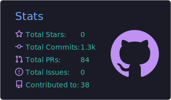
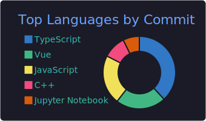

 

  
  &nbsp;
  

  
  &nbsp;
  
  &nbsp;
  
  &nbsp;
  

&nbsp;

&nbsp;

 

---

## About

I am a **Computer Science and Engineering undergraduate** at the **University of Moratuwa**, specializing in **Data Science**, with a strong foundation in **software engineering**, **full-stack development**, and **applied AI/ML**. I am fascinated by how machine learning and deep learning discover patterns from data, and how computer vision helps systems interpret visual information to solve real-world problems.

I build **production-oriented systems** end to end — from understanding requirements and designing user flows to shipping backend services, frontend interfaces, integrations, and deployment-ready features. My work spans **AI platforms**, **enterprise web applications**, **secure voting systems**, **finance operations tooling**, and **research-driven ML pipelines**.

Competing in programming contests, leading technical initiatives, and delivering client-facing products have taught me to think clearly under pressure, communicate with stakeholders, and turn ideas into **reliable, maintainable software**.

**Open to:** Software Engineering Internships · Full-Stack Engineering Roles · AI/ML Engineering Opportunities · Research Collaborations · Open Source Contributions

---

## Tech Stack

### Languages

  

### Frontend

  

### Backend & Databases

  

### Cloud, DevOps & Tooling

  

---

## GitHub Analytics

&nbsp;
  

  

---

## Contribution Activity

---

## Contribution Snake

---

*Engineering is the discipline of turning clarity under pressure into systems people can trust.*

